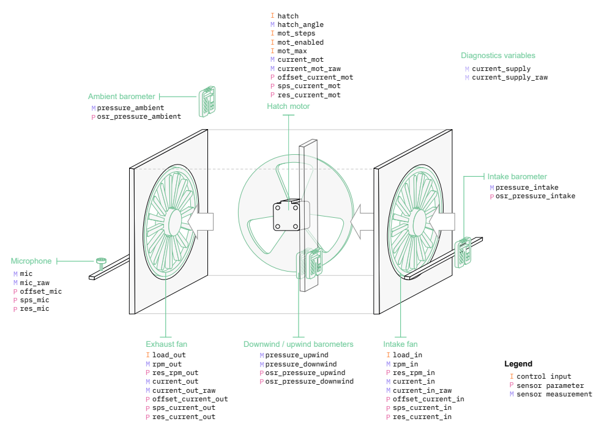
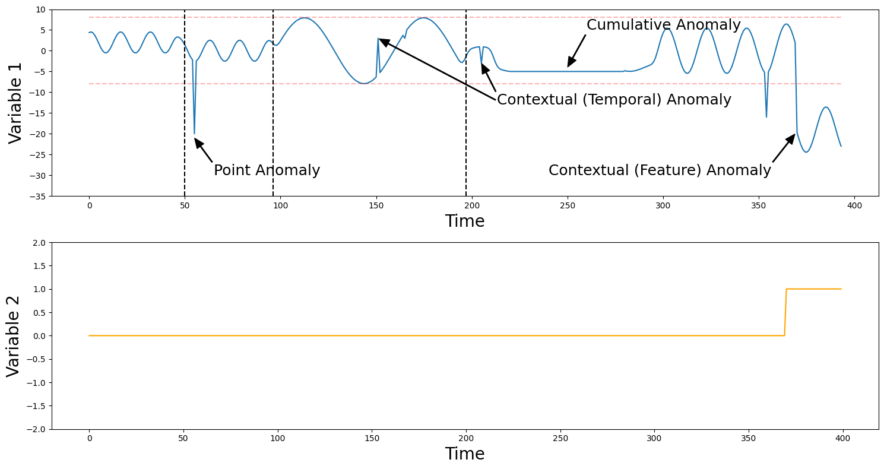
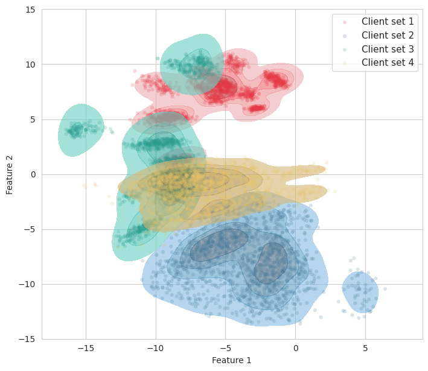
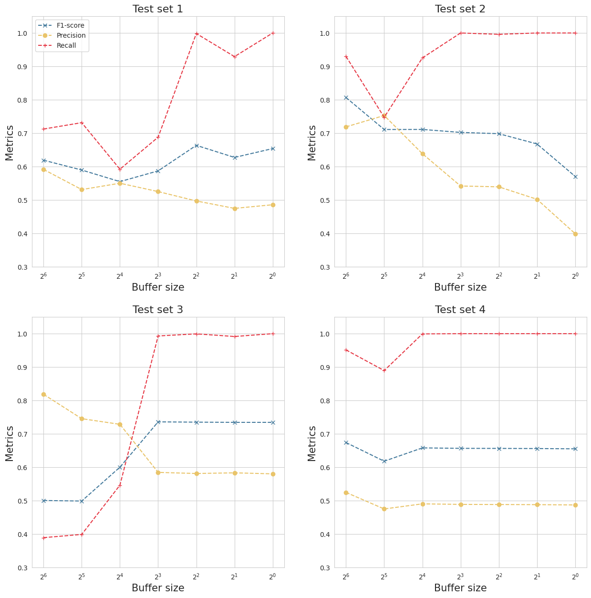

## Online and Federated Learning for Predictive Maintenance
*In collaboration with Scania AB and Uppsala University*

You can find the complete thesis report <a href="http://www.diva-portal.org/smash/record.jsf?pid=diva2:2083501">here</a>.

Electronic sensors on trucks produce large amounts of real-time data that can be used to model normal operations and identify anomalies to prevent systematic failures from happening. Several deep learning models such as GANs, LSTM-based autoencoders, and graph neural networks have been proposed for this task. However, these models either don't have an interpretable loss criterion, are slow to capture temporal dependencies, or are unstable to train in the presence of sparse correlations. We propose a transformer-based variational autoencoder (VAE) model that processes the entire time-series window in parallel, captures long-term dependencies, and has explainable reconstruction and KL divergence loss. We implement the said VAE model in an **online and federated setting** to collaboratively train multiple models on different trucks, allowing them to generalize well without sharing underlying data while also accounting for the memory constraints at the edge. We train this model on data generated from a wind tunnel from <a href="https://github.com/juangamella/causal-chamber">causal chamber</a>, which consists of fans, a hatch, and multiple pressure sensors, and acts as a proxy for truck components. To evaluate the performance of our setup, we track metrics such as precision, recall, F1-score, and the number of true positives, false positives, and false negatives.

<br>


*Figure 1. Wind tunnel machine*

<br>


*Figure 2. Types of anomalies introduced in time-series sensor data*

We take four such data streams but with different operating modes to end up with non-overlapping distributions.



*Figure 3. Distributions for the four data streams*

---

**Results**

|Data|Client 1|Client 2|Client 3|Client 4|Central data collection|Offline FL|
|:---|:-------|:-------|:-------|:-------|:----------------------|:---------|
|Test data 1|0.6912|0.6577|0.5869|0.6514|0.7490|0.7465|
|Test data 2|0.5704|0.6817|0.5560|0.7838|0.8592|0.8503|
|Test data 3|0.7180|0.7148|0.7273|0.7054|0.7566|0.7361|
|Test data 4|0.6675|0.6573|0.6553|0.6691|0.8016|0.7608|

*Table 1. F1-score for siloed training, central collection, and offline FL*

<br>



*Figure 4. Trends in precision, recall, and F1-score for different buffer sizes in online FL*

Our findings establish that the offline and federated learning setup generalizes well to non-overlapping distributions and performs better than local training, where models are trained on a single dataset in isolation. Their performance approaches close to that of the centralized data collection baseline. For the online and federated models, we show that the number of false positives increases sharply as the memory constraints are made severe. This is attributed to the model memorizing and overfitting on training samples.

---

```
@misc{sharma2026online,
  title={Online and Federated Learning for Predictive Maintenance in Heavy-Duty Vehicles},
  author={Sharma, Kartikey},
  year={2026}
}
```
