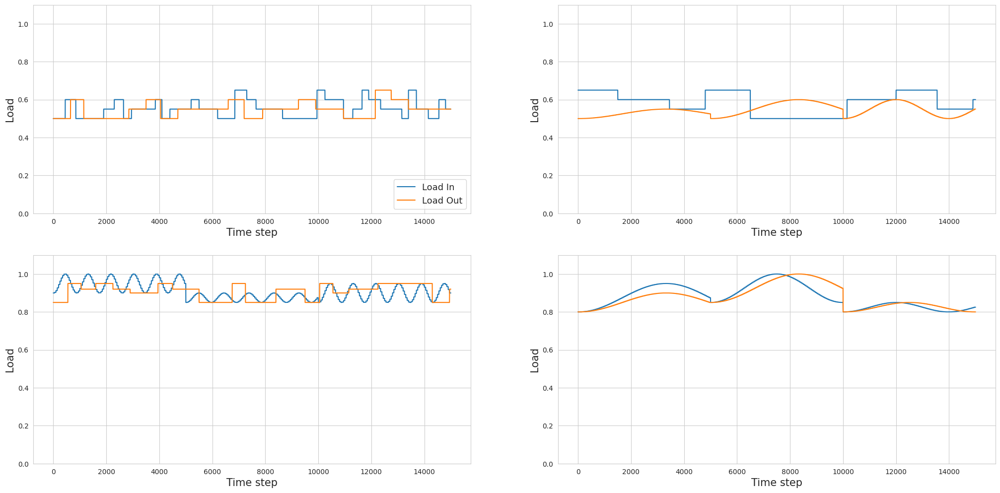
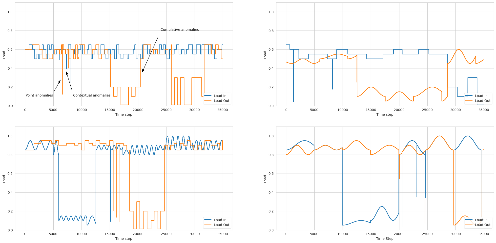

## Online and Federated Learning for Predictive Maintenance

*In collaboration with Scania AB*

<div align="justify">
New heavy-duty vehicles have multiple actuators and sensors that are used to generate and record time-series data streams, respectively. These data streams can be used to model what normal operations in trucks are supposed to look like and, by extension, can also be used to identify anomalies. These anomalies could be engine overheating, malfunction in the ABS, or fatigue in suspensions. We implemented a transformer-based variational autoencoder [<a href="https://arxiv.org/pdf/1706.03762">1</a>] [<a href="https://arxiv.org/pdf/1312.6114">2</a>] to detect anomalies in truck operations for predictive maintenance. There are two reasons for selecting this model: 1) Because it has an explainable reconstruction loss, and 2) Because it can parallely process the entire time series window. Now we are faced with two challenges. Firstly, we want the model to generalize well to different operating conditions. For example, if there is a truck being operated in a city area and is then sent to remote hilly regions for long-haul missions, it is very likely that the underlying data distribution would change, and we expect the model to perform well in either scenario. Secondly, because trucks don't have large memory, we want a training regime that is memory efficient. Our solution: <i>online and federated learning</i>. Federated learning [<a href="https://arxiv.org/pdf/1602.05629">3</a>] is a collaborative way to jointly train multiple machine learning models without exposing the underlying data. It improves model generalizability while keeping the data private and reducing communication inefficiencies. As for memory limitations, we apply online learning where the model is trained on an incoming data sample (or a time window in our case), its parameters are updated based on the loss function, and then the sample is discarded. Thus, we don't need to store historical data as in batch training. <i>We primarily answer two questions: </i> 1) How well does the offline FL implementation perform compared to siloed training and the central data collection baseline?; 2) What does the trade-off between memory and performance look like for online FL? BTW, the entire thesis can be found <a href="https://www.diva-portal.org/smash/get/diva2:2083501/FULLTEXT01.pdf">here</a>.
</div>
<br>


<div align="justify">
We use a causal chamber [<a href="https://www.nature.com/articles/s42256-024-00964-x">4</a>] wind tunnel device as a proxy for the actual truck component. It has actuators such as two fans and a hatch, and several pressure sensors at different positions. We can manipulate the actuators to record sensor data from a non-trivial system, where variables have first-order relations. The above figure also depicts the kind of anomalies we introduce. Point anomalies are impulses outside the normal operating range. In cumulative anomalies, a single point may be normal, but the entire window is anomalous (the signal being constant rather than sinusoidal). And lastly, contextual anomalies can be identified in the context of a small time window or with respect to another variable. So how do we generate anomalies? First, we define what normal operations are. In our case, they are sine and step signals (talking about fan loads) operating within a range of 0.5 and 1.0 with the hatch being closed. Using a combination of sine and step signals (with varying frequencies and amplitudes), we get <i>four</i> non-overlapping distributions. This is perfect for motivating FL implementation. We add anomalies by shifting the operating range between 0.1 and 0.3 for the intake and exhaust fans, opening the hatch, or adding negative impulses outside the normal range. Below, you can see the data streams and underlying data distributions.
</div>
<br>





*The four non-overlapping data streams and the associated anomalies. Below we see their respective latent distributions.*

---

*There is not much to discuss about the experiments. You can find the hyperparameters in the thesis PDF.*   
***Obseravations***

|  |Local train 1|Local train 2|Local Train 3|Local Train 4|Central Data Collection|Offline FL|
|:-|:------------|:------------|:------------|:------------|:----------------------|:---------|
|Test 1|0.6912|0.6577|0.5869|0.6514|**0.7490**|0.7465|
|Test 2|0.5704|0.6817|0.5560|0.7838|**0.8592**|0.8503|
|Test 3|0.7180|0.7148|0.7273|0.7054|**0.7566**|0.7361|
|Test 4|0.6675|0.6573|0.6553|0.6691|**0.8016**|0.7608|


<div align="justify">
In the first table, we observe the F1-score for siloed training, central data collection baseline, and offline FL, aggregated over 5 runs. We can clearly see that the offline FL implementation outperforms siloed training with an increase of 31.9% in the F1-score. The other image shows that as the memory buffer is reduced, the precision stays more or less the same, whereas recall initially drops and then skyrockets to 1.00. When we investigate the number of true positives, false positives, and false negatives, we see that the model tends to overfit and memorize whatever small number of samples it is trained on, and classifies all else as anomalies. Beyond a certain threshold, the model stops learning. This could be useful for an engineer to allocate sufficient memory on trucks and estimate model performance, so that the model can be trained while satisfying resource limitations. You can read more here.
</div>
<br>

```
@misc{sharma2026online,
  title={Online and Federated Learning for Predictive Maintenance in Heavy-Duty Vehicles},
  author={Sharma, Kartikey},
  year={2026}
}
```
